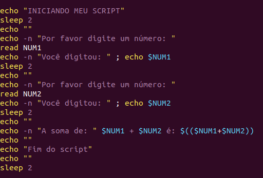

## Uso básico de Shell-Script (Bash)
A ideia aqui é apresentar um pouco de Shell Script como um meio agradável e simples de automatizar tarefas do dia a dia.


-> Script para gerar relatório do sistema: [RelatorioMaquina.sh](https://github.com/amaurybsouza/Shell-Script/blob/master/CursoShellScript/ScriptsAmaury/RelatorioMaquina.sh).

-> Script simples que mostra um exemplo básico do Case: [ScriptCase.sh](https://github.com/amaurybsouza/Shell-Script/blob/master/CursoShellScript/ScriptsAmaury/ScriptCase.sh).

-> Mostrando a hora atual: [HoraAtual.sh](https://github.com/amaurybsouza/Shell-Script/blob/master/CursoShellScript/ScriptsAmaury/HoraAtual.sh).

-> Script que soma valores: [SomaValores.sh](https://github.com/amaurybsouza/Shell-Script/blob/master/CursoShellScript/ScriptsAmaury/SomaValores.sh)

-> Script básico de um menu usando o Case: [MenuCase.sh](https://github.com/amaurybsouza/Shell-Script/blob/master/CursoShellScript/ScriptsAmaury/MenuCase.sh)

-> Script que gera um relatório de um usuário do sistema: [RelatoriodeUsuario.sh](https://github.com/amaurybsouza/Shell-Script/blob/master/CursoShellScript/ScriptsAmaury/RelatoriodeUsuario.sh)

-> Script que mostra um exemplo básico de operações com valores: [OperacoesValores.sh](https://github.com/amaurybsouza/Shell-Script/blob/master/CursoShellScript/ScriptsAmaury/OperacoesValores.sh)

## Instruções de Loop - For (Exemplos de uso)

```
for variavel in valor1 valor2 ... valorN
do
comando1
comando2
...
done
```

```
for numero in 1 2 3 4 5
do
echo “O número atual é $numero“
done
```
```
for arquivo in alunos*
do
echo “O arquivo atual é $arquivo“
done
```
```
for sequencia in $(seq 5 10)
do
echo “O número é $sequencia“
done
```
```
for i in $(cat arquivo.txt)
do
echo “A valor atual é $i“
done
```
```
for (( i=5 ; i <= 20 ; i++ ))
do
echo “O número é $i“
done
```


## Uso de Shell Script (Bash) para automação da infra de TI

```Veja abaixo a linha de comando:```




